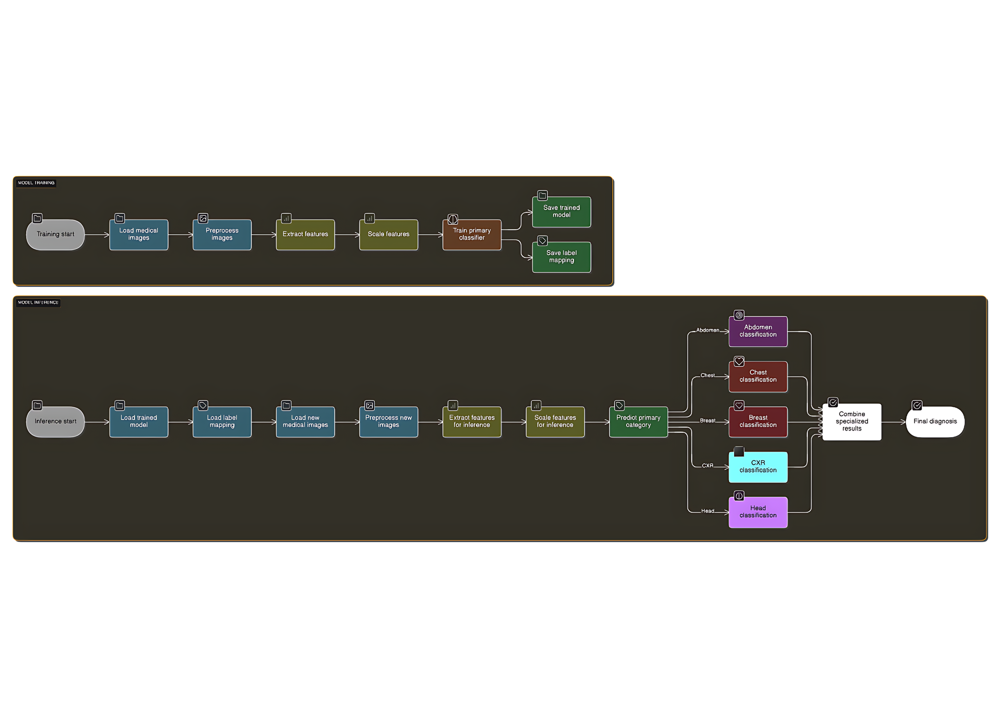

<div align="center">
  

  <h1>MediScan - Multi-Modal Medical Diagnostic System</h1>

  <p>
    <strong>An end-to-end medical imaging pipeline for multi-class disease detection across CT, MRI, and X-Ray modalities.</strong>
  </p>

  [](LICENSE)
  [](https://reactjs.org)
  [](https://flask.palletsprojects.com/)
  [](https://www.python.org/)
</div>

---

## Executive Summary
MediScan is a high-fidelity medical imaging system designed to move beyond "black-box" CNN implementations. The project involved engineering a custom end-to-end pipeline—from raw image normalization and tensor transformation to a proprietary weight/bias storage system and a physician-facing diagnostic interface.

Instead of relying on high-level abstractions, this system utilizes pure softmax-based classification layers to provide interpretative confidence scores for 21 distinct medical conditions across 5 different imaging modalities.

---

## Dataset and Diagnostic Scope
The system is trained on a comprehensive dataset of **21,000 high-resolution medical images** categorized into 21 diagnostic classes.

| Modality | Diagnostic Classes | Class Count |
| :--- | :--- | :--- |
| **Abdomen CT** | Cyst, Stone, Tumor, Normal | 4 |
| **Head CT** | Alzheimer (3 stages), Tumor (3 types), Normal | 7 |
| **CXR (X-Ray)** | Normal, Pneumonia, Tuberculosis | 3 |
| **Chest CT** | Lung-Cancer patterns (4), Normal | 5 |
| **Breast MRI** | Cancer, Normal | 2 |
| **Total** | | **21 Classes** |

---

## System Architecture
The architecture is decoupled to ensure that the heavy computational demands of medical image processing do not interfere with the responsiveness of the clinical UI.

* **Frontend:** React-based diagnostic dashboard allowing doctors to upload scans and view localized heatmaps/results.
* **Inference Engine:** Flask microservice serving custom-serialized models.
* **Custom Pipeline:** Manual implementation of image preprocessing, including grayscale normalization, resizing, and pixel-value scaling.
* **Weight Management:** Optimized system for storing and loading model weights and biases without the overhead of standard heavy frameworks.

---

## Key Technical Features

| Feature | Implementation Detail |
| :--- | :--- |
| **Custom Preprocessing** | Rigid normalization pipeline to handle variance in medical image lighting and resolution. |
| **Proprietary Weights** | Custom serialization logic for storing and retrieving trained model parameters. |
| **Softmax Inference** | Deterministic probability distribution for diagnostic confidence scoring. |
| **Multi-Modal Support** | Unified API structure to handle different image dimensions (CT, MRI, X-Ray) dynamically. |

---

## Local Development Setup

### 1. Clone the Repository
```bash
git clone [https://github.com/AnuragGaonkar/Disease-detection-using-medical-images.git](https://github.com/AnuragGaonkar/Disease-detection-using-medical-images.git)
cd Disease-detection-using-medical-images
```

### 2. Environment Setup

**Backend (Python):**
```bash
cd backend
pip install -r requirements.txt
python app.py
```

**Frontend:**
```bash
npm install
npm start
```

## Engineering Challenges and Resolutions

### Standardizing Multi-Modal Inputs
* **Challenge**: Processing images from 5 different modalities (CT, MRI, X-Ray) requires different normalization techniques, as raw pixel intensity varies wildly between a chest X-ray and a brain MRI.
* **Resolution**: Engineered a modular preprocessing class that detects image metadata and applies modality-specific normalization curves before converting the data into tensors.

### Moving Beyond Black-Box Inference
* **Challenge**: Most standard libraries hide the logic of how weights are stored and predictions are generated, making it difficult to optimize for low-latency medical environments.
* **Resolution**: Designed the inference engine from scratch using pure softmax layer. This included building custom logic to load serialized weights and biases directly into the mathematical model, reducing overhead and increasing diagnostic speed.

---

## Visuals and Demos

### System Architecture Flow



### Diagnostic Walkthrough
*Demonstration of the end-to-end medical diagnostic flow: Image upload, automated preprocessing, and 21-class diagnostic inference.*

> [!IMPORTANT]
> **[Watch High-Resolution MediScan Demo](public/video/mediscan.mp4)**

---

## Contact and Links
**Anurag Gaonkar** - [GitHub](https://github.com/AnuragGaonkar) | [LinkedIn](https://www.linkedin.com/in/anurag-gaonkar-68a463261)

Project Link: [https://github.com/AnuragGaonkar/MediScan](https://github.com/AnuragGaonkar/MediScan)
